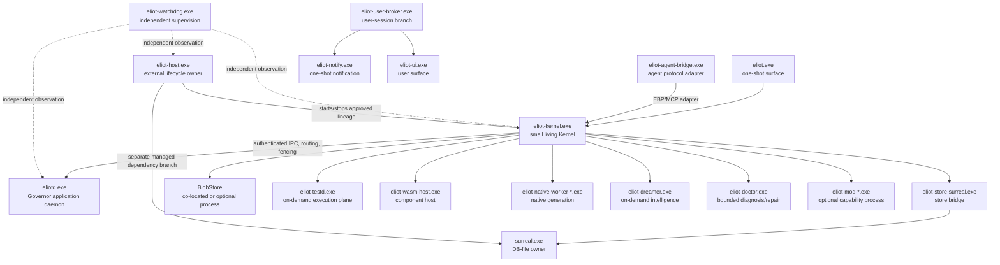

# Kernel and daemon architecture traceability graph v1

Status: source/documentation traceability artifact. This is not a runtime-health
claim and does not promote a planned contour to `landed`.

## Evidence identity

- CodeCortex project: `eliot-memory-os-3c7676b-persist`; source checkout used:
  `5d77ca3a3f82fe1d47db98b604928a3e64c56e44`.
- CodeCortex project: `eliot-architecture-docs-fa941135`; canonical files read:
  `docs/architecture/ELIOT_ARCHITECTURE.md` and
  `docs/architecture/ELIOT_IMPLEMENTATION.md`.
- Canonical documentation snapshot hashes: Architecture
  `58E71A2BDB10925C63D85A708ED768AEE8617BED0FB52EB044478EC20AB439D8`;
  Implementation
  `C216FB7F6FDBC62D108C748BE6F61CA7EF9E5D24E5BB13AF2677C31A58460C0B`.
- The two canonical documents state that physical form is an Implementation
  choice, not an Architecture-imposed process-per-module or numeric-size rule
  (A2.3; I2.2, I2.16). The `<10k LOC` column below is therefore an explicit
  migration invariant for this graph, not a claimed normative Architecture
  limit.

## Causal graph

The graph follows the documented topology, not an assumption that every source
file is a process: I1.1 says pure cancellable computation remains in-process;
I1.2/I1.3 enumerate the mandatory and optional process contours.

## Kernel micro-module traceability

`landed` means the named source boundary and anchor exist in the inspected
checkout. `landed in root; planned extraction` means the capability exists but
has no dedicated file yet. A planned dedicated path is not represented as
present source.

| Kernel cell | Exact source/module path | Owner responsibility | Forbidden semantics | Architecture anchors / principles | Implementation anchors | State | `<10k LOC` split invariant |
|---|---|---|---|---|---|---|---|
| Composition root | `bins/eliot-kernel/src/lib.rs::{KernelComposition,assemble,apply_control_request}` (around lines 323–8849) | Compose identity, authority, fencing, lifecycle and capability boundaries | No model/Dreamer semantics, second Governor, or alternate canonical writer | A2.3; A13.2; `ARCH-MOD-01`, `ARCH-AUTH-01`, `ARCH-SEC-02` | I1.2; I2.15; I2.16 | landed; remaining root is the extraction source | **FAIL currently:** 14,568 LOC; split target is explicit |
| `store_gateway` | `crates/kernel/eliot-kernel-service/src/store_gateway.rs::KernelStoreGateway` (line 113; 277 LOC) | Fence/drain the Kernel-facing store bridge and expose bounded store operations | No raw SurrealQL, DB credentials in Kernel, semantic ownership, or second store-root owner | A2.3; A12.3; A13.2; `ARCH-SEC-02`, `ARCH-RES-01` | I1.2; I5.1; I5.9; I5.11; I15.8 | landed | PASS (277 LOC) |
| `front_door_session` | `bins/eliot-kernel/src/front_door_session.rs::{IpcImplementation,KernelComposition::front_door_peer_set,front_door_peer_set_snapshot,bind_session}` (310 LOC) | Authenticated local IPC, peer set, Session binding and transport limits | No dispatch matrix, daemon lifecycle mutation, Governor decision, or unscoped peer authority | A2.3; A12.2; A12.3; `ARCH-AUTH-01`, `ARCH-SEC-01`, `ARCH-SEC-02` | I1.2; I7.1; I7.3; I7.5; I7.14; I15.2 | landed | PASS (310 LOC) |
| `generation_recovery` | `bins/eliot-kernel/src/generation_recovery.rs::{OrsGenerationCoordinator,recover,persist_and_publish}` (155 LOC) | Durable generation cutover/recovery and handshake projection | No semantic planning, alternate epoch owner, silent stale-route resurrection, or process lifecycle ownership | A5.4; A13.2; A13.3; `ARCH-AUTH-01`, `ARCH-RES-03`, `ARCH-RES-04` | I1.2; I4.5; I5.6; I14.14–I14.16; I14.21 | landed | PASS (155 LOC) |
| `daemon_request_dispatch` | `bins/eliot-kernel/src/daemon_request_dispatch.rs::KernelComposition::execute_daemon_request` (193 LOC) | Closed authenticated daemon request/response projection | No `dispatch_frame`, process execution, semantic Governor mutation, or alternate response authority | A12.2; A12.3; A13.2; `ARCH-AUTH-01`, `ARCH-SEC-02`, `ARCH-RES-04` | I1.2; I1.8; I7.2; I7.14; I14.6; I15.2 | landed | PASS (193 LOC) |
| `control_plane` | `bins/eliot-kernel/src/lib.rs::KernelComposition::apply_control_request` (line 8427) | Kernel Control Reserve, bounded operational commands and recovery-facing control | No task truth, semantic plan ownership, hidden write path, or unbounded control queue | A2.3; A12.3; A13.2; `ARCH-SEC-02`, `ARCH-RES-04`, `ARCH-ORD-01` | I1.2; I1.8; I14.3–I14.6; I14.23; I15.8 | landed in root; planned extraction | N/A while in 14,568-LOC root; planned split |
| `process_execution` | `bins/eliot-kernel/src/lib.rs::KernelComposition::execute_process_request` (line 6722); `crates/kernel/eliot-process/src/lib.rs` | Admit, execute and reconcile approved process operations | No ambient command execution, path widening, task completion, or process authority outside the execution contract | A2.3; A13.2; `ARCH-AUTH-01`, `ARCH-RES-01` | I1.2; I2.15; I14.6; I14.24; I15.3 | landed in root; planned extraction | N/A while in root; planned split |
| `supervision_lease` | `bins/eliot-kernel/src/lib.rs::{daemon_supervision_contour,renew_current_supervision,establish_daemon_supervision}` (lines 7121, 7401, 7468) plus `crates/foundation/eliot-runtime-contracts/src/supervision_lease.rs` (1,304 LOC) | Epoch-fenced lease identity, admission, renewal, terminal disposition and proof | No self-issued authority, stale lease continuation, hidden renewal, or semantic completion | A5.4; A12.2; A13.2; `ARCH-AUTH-01`, `ARCH-RES-03` | I5.6; I6.10; I7.14; I8.1; I14.10; I14.14 | landed in contract/root; planned Kernel extraction | Contract file PASS (1,304 LOC); root split still required |
| `agent_bridge_activation` | `bins/eliot-kernel/src/lib.rs::{begin_agent_bridge,enqueue_agent_bridge_activation,await_agent_bridge_activation_response}` (lines 5848, 6015, 6298) | Bound agent-bridge admission, activation ticket and response/fence lifecycle | No durable agent state, DB credentials, direct semantic write, or bridge-owned Kernel authority | A2.3; A10.6; A12.2; `ARCH-AUTH-01`, `ARCH-SWM-01`, `ARCH-SWM-02` | I1.2; I7.1; I7.3; I10.1–I10.3; I10.15 | landed in root; planned extraction | N/A while in root; planned split |
| `daemon_supervision` | `bins/eliot-kernel/src/lib.rs::{daemon_supervision_contour,establish_daemon_supervision,renew_daemon_supervision_for_probe}` (lines 7121, 7468, 7484) | Physical daemon lineage, supervision contour, readiness and bounded renewal | No infinite restart loop, semantic oracle, or daemon-owned authority/lease replacement | A8.1; A13.2; A13.3; `ARCH-WDG-01`, `ARCH-RES-01`, `ARCH-RES-04` | I1.4; I1.5; I8.1–I8.4; I14.10; I14.15 | landed in root; planned extraction | N/A while in root; planned split |

The current Kernel source therefore satisfies the file-level split for the first
four cells but not the `<10k` root invariant. This is an observed migration
state, not evidence that Architecture mandates a 10k threshold.

## Daemon/process traceability

| Process/capability | Exact source/module path | Owner responsibility | Forbidden semantics | Architecture anchors / principles | Implementation anchors | State | `<10k LOC` split invariant |
|---|---|---|---|---|---|---|---|
| `eliot-host.exe` | `bins/eliot-host/src/main.rs::main/run_as_scm_service`; `bins/eliot-host/src/lib.rs::launch_store_then_kernel` | Installation, approved artifacts, HostStateJournal, process/job lifecycle and bounded restart | No project semantics, sessions, task state, model routing, or repairs | A2.2; A13.2; `ARCH-RES-01`, `ARCH-AUTH-01` | I1.1; I1.2; I1.4; I3.1; I14.16 | landed | PASS as a bounded process source |
| `eliot-kernel.exe` | `bins/eliot-kernel/src/main.rs::main/run`; `bins/eliot-kernel/src/lib.rs::KernelComposition` | Identity, session/fencing, ORS, Control Reserve, routing and canonical transition boundary | No semantic curation, broad retrieval, UI, or model authority | A2.2; A2.3; A13.2; `ARCH-MOD-01`, `ARCH-AUTH-01` | I1.1; I1.2; I1.4; I1.8; I2.15 | landed; root split invariant not yet met | **FAIL:** root `lib.rs` 14,568 LOC |
| `eliotd.exe` | `bins/eliotd/src/main.rs::{main,run,run_loop}`; `bins/eliotd/src/lib.rs::DaemonKernelClient` | WorkScopes, tasks/plans, write admission, read models, Context Compiler, Agent Coordinator, Durable Jobs and reports | No Kernel identity/fencing ownership, hidden canonical writer, or ungoverned external effect | A2.2; A12.3; `ARCH-LIFE-01`, `ARCH-SEC-02` | I1.2; I1.5; I1.8; I6.4; I12.1 | landed | PASS as process boundary; exact runtime LOC not used as normative size claim |
| `eliot-watchdog.exe` | `bins/eliot-watchdog/src/main.rs::{main,run_watchdog,run_as_scm_service}`; `bins/eliot-watchdog/src/lib.rs::VerifiedWatchdogAdmission` | Independent liveness, protocol, security, integrity observation and signal spool | No semantic oracle, canonical transition, task completion, or hidden repair writer | A8.1–A8.6; `ARCH-WDG-01`, `ARCH-WDG-02`, `ARCH-RES-01` | I1.2; I1.4; I8.1–I8.18; I14.10 | landed | PASS as bounded process source |
| `eliot-store-surreal.exe` | `bins/eliot-store-surreal/src/main.rs::{main,run}`; `bins/eliot-store-surreal/src/lib.rs::StoreSchemaBootstrapCommand` | Store bridge with the only ELIOT SurrealDB credentials/SDK and bounded named queries | No raw runtime SurrealQL, semantic authority, or second canonical store owner | A12.3; A13.2; `ARCH-SEC-02`, `ARCH-RES-01` | I1.2; I5.1; I5.9; I5.11; I15.3 | landed | PASS as process source |
| `surreal.exe` | External Host-managed dependency; no Rust source path in this checkout | Own database files; Host supplies manifest, containment and lifecycle | No ELIOT task/authority semantics or unapproved credential channel | A13.2; `ARCH-RES-01`, `ARCH-SEC-01` | I1.2; I1.4; I5.9; I15.3 | planned/external; runtime path unverified | N/A (external binary) |
| BlobStore / optional `eliot-blob.exe` | `crates/storage/eliot-blob/src/lib.rs` contract; no `bins/eliot-blob` observed | Immutable payload root, staging, hashing, encryption envelope, reachability/GC and `BlobReadyReceipt` | No SurrealDB credentials, semantic query, or self-created canonical reference | A2.3; A12.3; `ARCH-SEC-02`, `ARCH-RES-01` | I1.2; I5.12; I14.27 | contract landed; executable process planned after isolation proof | PASS for contract; process N/A until planned |
| `eliot-dreamer.exe` | `bins/eliot-dreamer/src/main.rs::main`; `bins/eliot-dreamer/src/lib.rs::DreamJobInput` | On-demand intelligence jobs and candidate synthesis | No authority promotion, canonical write, or mandatory Kernel hot-path dependency | A9.1–A9.6; `ARCH-DRM-01`, `ARCH-DRM-04` | I1.3; I9.1–I9.17 | landed | PASS as optional process source |
| `eliot-doctor.exe` | `bins/eliot-doctor/src/main.rs::main`; `bins/eliot-doctor/src/lib.rs` | Bounded diagnosis and repair alternatives/evidence | No infinite repair, semantic writer, or self-certifying completion | A8.6; A13.3; `ARCH-RES-02`, `ARCH-RES-05` | I1.3; I8.10–I8.13; I14.25–I14.26 | landed | PASS as optional process source |
| `eliot-mod-<id>.exe` | Existing concrete contour: `bins/eliot-mod-research/src/{main.rs,lib.rs}`; generic family otherwise has no single source path | Replaceable optional capability/process generations | No implicit Kernel/Governor ownership, direct DB write, or unbounded effect | A2.3; A13.2; `ARCH-MOD-02`, `ARCH-PORT-01` | I1.3; I2.2; I10.12; I14.27 | research instance landed; generic family planned | PASS per bounded instance; family N/A |
| `eliot-ui.exe` | Canonical process name only; no `bins/eliot-ui` source observed (WinUI adapter is documented) | Thin user-session ControlBoard/Operator surface | No canonical state, DB credentials, scheduler, or authority | A11.1–A11.5; `ARCH-HUM-01`, `ARCH-AUTH-01` | I1.3; I11.1–I11.11 | planned; source/runtime unverified | N/A until source exists |
| `eliot-user-broker.exe` | `bins/eliot-user-broker/src/main.rs::main`; `bins/eliot-user-broker/src/lib.rs::{BrokerConfig,KernelAuthorityPort}` | User-session credentials/config handles, scoped interactive launches and broker-owned child job | No canonical state, route policy, generic shell, path/budget widening, or service impersonation | A2.2; A12.2; `ARCH-AUTH-01`, `ARCH-SEC-01` | I1.3; I1.6; I15.2–I15.3; I14.17 | landed | PASS as bounded process source |
| `eliot.exe` | `bins/eliot/src/main.rs::{main,run}` | One-shot user/agent/operator CLI over existing contracts | No semantic state, scheduler, policy, recovery journal, or alternate command authority | A11.1; A12.3; `ARCH-SEC-02`, `ARCH-HUM-01` | I1.3; I1.8; I11.1; I11.3; I14.23 | landed | PASS as one-shot surface |
| `eliot-notify.exe` | `bins/eliot-notify/src/main.rs::main`; `bins/eliot-notify/src/lib.rs::NotificationComposition` | One-shot per-user notification delivery from signed envelope | No canonical state, repair, authority transition, or broad read | A11.5; A12.2; `ARCH-HUM-01`, `ARCH-AUTH-01` | I1.3; I11.5–I11.8 | landed | PASS as one-shot surface |
| `eliot-agent-bridge.exe` | `bins/eliot-agent-bridge/src/main.rs::main`; `bins/eliot-agent-bridge/src/lib.rs::{BridgeRunner,KernelHostActivationPort}` | Thin host protocol ↔ EBP/MCP adapter with profile-bound admission | No durable semantic state, DB credentials, or Kernel/Governor authority | A2.2; A10.1–A10.3; `ARCH-AUTH-01`, `ARCH-SWM-01` | I1.3; I7.1; I10.1–I10.4 | landed | PASS as thin process source |
| `eliot-testd.exe` | `bins/eliot-testd/src/main.rs::main`; `bins/eliot-testd/src/lib.rs::{TestdJobRequest,TestdComposition}` | Isolated build/test/simulation process trees and verification artifacts | No second scheduler, task DB, completion claim, or Control Reserve consumption | A2.3; A13.2; `ARCH-MOD-02`, `ARCH-RES-01` | I1.3; I1.5; I10.8; I14.6; I14.24 | landed | PASS as bounded process source |
| `eliot-wasm-host.exe` | `bins/eliot-wasm-host/src/main.rs::main`; `bins/eliot-wasm-host/src/lib.rs::WasmHostRunner` | Capability-limited Wasmtime component generations and instance/resource limits | No canonical DB credentials, raw process capability, or ungranted filesystem/network access | A2.3; A13.2; `ARCH-MOD-02`, `ARCH-PORT-01` | I1.3; I2.19; I14.19; I15.10 | landed | PASS as bounded process source |
| `eliot-native-worker-<class>.exe` | `bins/eliot-native-worker/src/{main.rs,lib.rs}::{main,NativeWorker}` | Isolated OS-heavy/promoted native generations under manifest/capability envelope | No shared Rust references/allocator, direct Kernel loading, or unpinned effects | A2.3; A13.2; `ARCH-MOD-02`, `ARCH-PORT-01` | I1.3; I2.15; I14.18; I14.27 | landed | PASS as bounded process source |

## Refresh and integration rule

After integrating any source extraction or process-contour change, refresh this
graph from both CodeCortex projects before updating status: re-resolve the exact
source symbols and callers/callees, re-read the relevant Architecture and
Implementation section IDs, recompute the checkout/document hashes and LOC,
then update only rows whose evidence changed. A `landed` label requires the
source path and anchor to exist at the new source hash; a runtime claim requires
separate live verification. The graph itself is documentation-only and never
changes source ownership or authority.

## Verification record

- Markdown/source anchors checked against the current checkout and canonical
  section headings.
- `git diff --check` is the required artifact gate.
- No product code, schema, dependency, or tests were changed/run for this
  documentation artifact.
